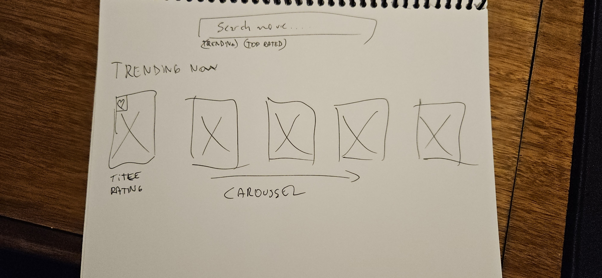
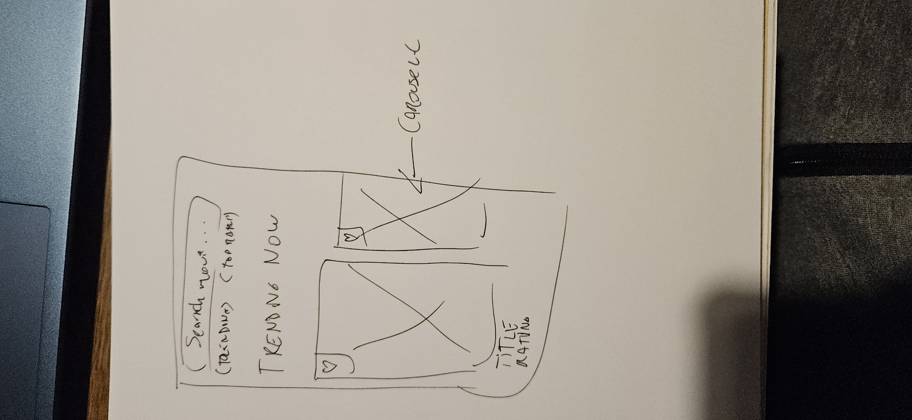
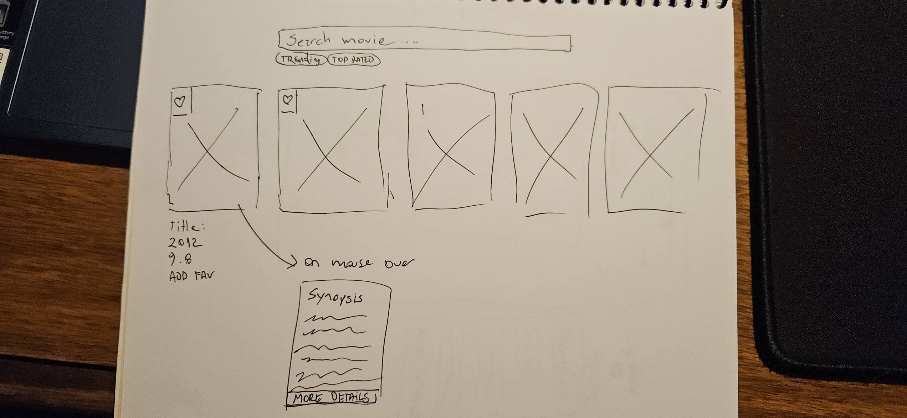
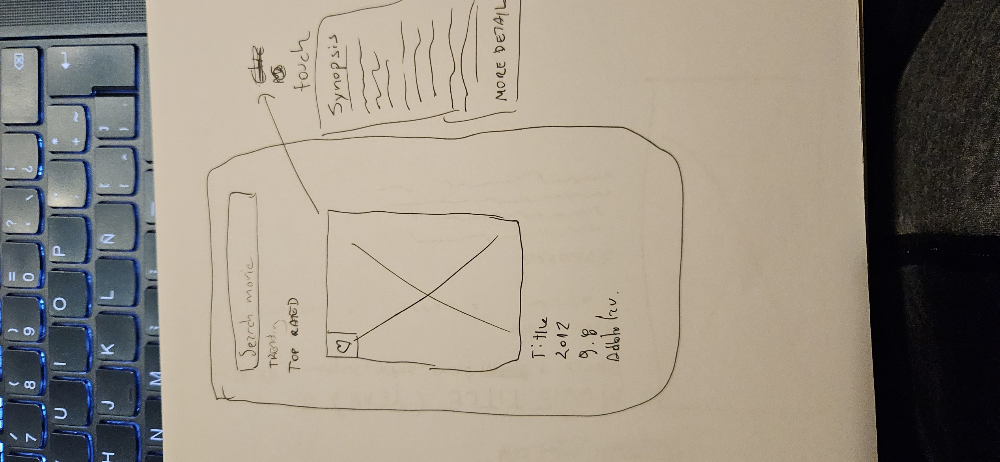
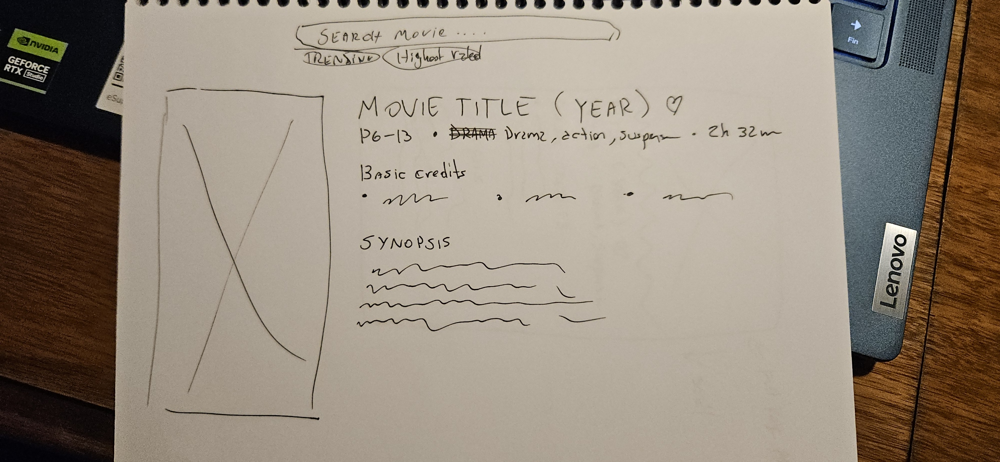
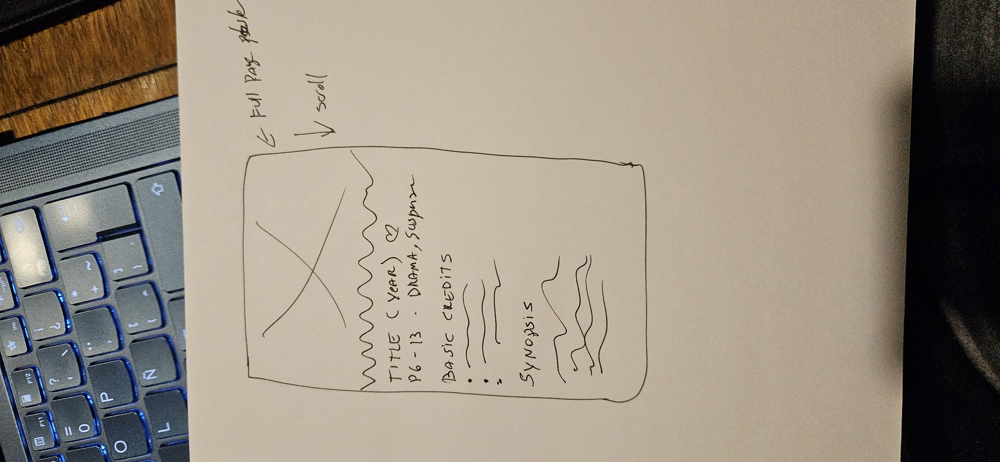

# React Movie Explorer

A movie search and discovery app built with **React** and **Redux**, powered by [The Movie Database (TMDB)](https://www.themoviedb.org/) API.  
Users can search movies, view details, and explore trending titles with a responsive and user-friendly design.

---

## Table of Contents

- [Overview](#overview)
- [Wireframes](#wireframes)
- [Features](#features)
- [Technologies Used](#technologies-used)
- [Future Work](#future-work)
- [Getting Started](#getting-started)

---

## Overview

The goal of this project is to demonstrate the ability to build a full-featured web application using **React** and **Redux**, connect to an external API (TMDB), handle error states gracefully, and provide a cohesive design across devices and browsers.

---

## Wireframes

### Home / Search




### Search Results




### Movie Details




---

## Features (MVP)

- Search for movies by title.
- Display search results in a responsive grid.
- View detailed information about a movie (poster, synopsis, genres, rating).
- Error handling for failed API calls with retry/back options.
- Responsive design for desktop, tablet, and mobile.

---

## Future Work

- Filters (by genre, year, popularity).
- Trending/Now Playing section.
- Favorites (saved in localStorage).
- Animations and transitions between pages.
- Infinite scroll or pagination.
- Dark mode.
- Progressive Web App (PWA) support.

---

## Technologies Used

- **React** (frontend framework)
- **Redux Toolkit** (state management)
- **React Router** (routing)
- **Vite** (development/build tool)
- **TMDB API** (external data source)
- **CSS / Tailwind CSS** (styling)
- **Vitest + Testing Library** (unit testing)
- **Playwright** (end-to-end testing)

---

## Getting Started

1. Clone the repo:
   ```bash
   git clone https://github.com/<your-username>/react-movie-explorer.git
   cd react-movie-explorer
   ```
2. Install dependencies
   ```bash
   npm install
   ```
3. Set up environment variables
   Create a .env file in the root of your project
   Add your TMDB API key:
   VITE_TMDB_API_KEY=your_api_key_here
   You can request a free API key at TMDB
4. Run the development server:
   ```bash
   npm run dev
   ```
